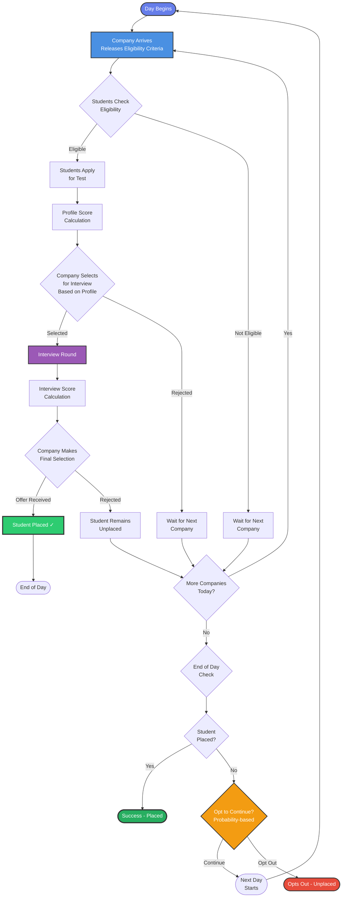
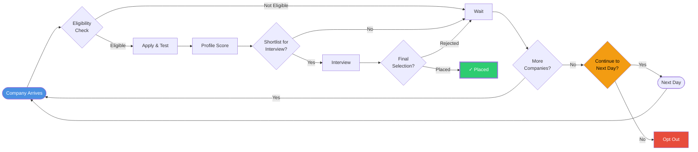
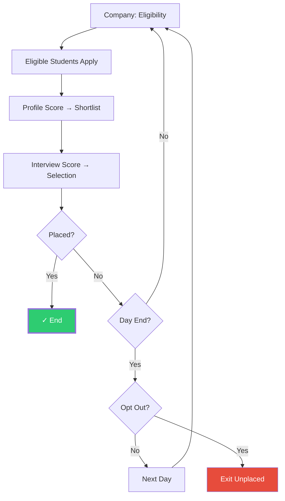

# Placement Simulation Model - Conceptual Flowchart

## Process Flow Diagram

## Compact Version (For Presentations)

## Ultra-Compact Version (Minimal)

## Key Process Elements

### 1. **Company Arrival Phase**
- Company releases eligibility criteria (CGPA, Department, Skills)
- Students check if they meet requirements

### 2. **Application & Profile Scoring**
- Eligible students apply
- Profile score calculated based on:
  - CGPA
  - Skills match
  - Domain alignment

### 3. **Interview Shortlisting**
- Company selects top candidates based on profile score
- Shortlisted students proceed to interview

### 4. **Interview & Final Selection**
- Interview score calculated
- Final selection based on interview performance
- Selected students receive offers

### 5. **Daily Cycle Management**
- Unplaced students wait for next company (same day)
- At day end, probability-based decision to continue or opt out
- Students opting to continue move to next day

## Model Features

✅ **Multi-stage selection** (Eligibility → Profile → Interview)  
✅ **Dynamic scoring** (Profile score + Interview score)  
✅ **Daily cycles** (Multiple companies per day)  
✅ **Student agency** (Probability-based opt-out decisions)  
✅ **Realistic constraints** (Eligibility filtering, limited seats)

---

*Use the version that best fits your presentation space and detail requirements*
