# SLIDE 1: Conceptual Model - Overview

## Slide Title
**"Campus Placement Simulation: Multi-Stage Process Model"**

---

## Main Visual: Process Flow Diagram (Mermaid)

```mermaid
flowchart TB
    Start([Start: Day 1 Placement]) --> StudentPool[Student Pool<br/>1223 Students]
    StudentPool --> CompanyVisit[Companies Visit<br/>Serial 1 & Serial 2]
    
    CompanyVisit --> Stage1[STAGE 1:<br/>Application Phase]
    Stage1 --> Eligibility{Eligibility<br/>Check}
    Eligibility -->|Pass| Stage2[STAGE 2:<br/>Test Phase]
    Eligibility -->|Fail| Rejected1[Rejected]
    
    Stage2 --> TestScore{Test Score<br/>Evaluation}
    TestScore -->|Top N| Stage3[STAGE 3:<br/>Interview Shortlist]
    TestScore -->|Others| Rejected2[Rejected]
    
    Stage3 --> Interview[STAGE 4:<br/>Interview & Hiring]
    Interview --> Offers[Offers Made]
    
    Offers --> Stage5[STAGE 5:<br/>Offer Acceptance]
    Stage5 --> Decision{Student<br/>Choice}
    Decision -->|Accept| Placed[✓ Placed]
    Decision -->|Reject/Multiple| NextCompany[Next Company]
    Decision -->|Opt Out| OptOut[Opted Out]
    
    Placed --> EndDay{More<br/>Companies?}
    Rejected1 --> EndDay
    Rejected2 --> EndDay
    NextCompany --> EndDay
    OptOut --> End([End of Day])
    EndDay -->|Yes| CompanyVisit
    EndDay -->|No| Results[Final Results]
    Results --> End
    
    style Start fill:#e1f5e1
    style Placed fill:#90EE90
    style OptOut fill:#FFB6C1
    style Rejected1 fill:#FFB6C1
    style Rejected2 fill:#FFB6C1
    style End fill:#e1f5e1
```



---

## Key Points (Bullet Format)

### 🎯 Objective
- **Simulate the real-world campus placement process**
- Model the 4-day internship recruitment cycle
- Predict placement outcomes based on student profiles and company requirements

### 📊 Scope
- **1,223 students** across 21 departments
- **79 companies** visiting over 2 serials (Day 1)
- Multiple roles: SDE, Quant, Data, Finance, Consulting, Core Engineering

### 🔄 Multi-Stage Process
1. **Application** - Students apply to eligible companies
2. **Test** - All applicants take company tests
3. **Shortlist** - Top performers invited for interviews
4. **Interview & Hiring** - Companies make offers
5. **Acceptance** - Students accept/reject offers

---

## Speaker Notes

### Opening (30 seconds)
"Good morning/afternoon. Today I'll present a comprehensive simulation model for campus placements. This project aims to replicate the complex, multi-stage recruitment process that occurs during internship season."

### Main Content (1.5 minutes)

**Introduce the Challenge:**
"Campus placements involve hundreds of students competing for limited positions across dozens of companies. The process is inherently complex with multiple stakeholders - students, companies, and the placement cell - each with different objectives and constraints."

**Explain the Flow:**
"Our model captures this complexity through a 5-stage pipeline:

Starting with **Stage 1 - Application**, where students apply to companies based on eligibility criteria like CGPA cutoffs, department requirements, and domain preferences.

**Stage 2 - Test Phase**: All eligible applicants take company-specific tests. This is modeled using a Profile Score that combines CGPA, skill match, and randomness to simulate test performance variability.

**Stage 3 - Interview Shortlisting**: Companies select top N performers based on test scores. This simulates the real-world constraint of limited interview slots.

**Stage 4 - Interview & Hiring**: Shortlisted candidates undergo interviews, scored using a combination of their profile score, CGPA, and interview performance. Companies make offers based on their hiring needs.

**Stage 5 - Offer Acceptance**: Students receive offers and make decisions. Some accept immediately, some wait for better offers, and some opt out due to external factors like higher studies or family businesses."

**Highlight Key Features:**
"The model incorporates several realistic elements:
- **Randomness** in test and interview performance to simulate real-world variability
- **Student opt-outs** (5% probability) representing students who withdraw from the process
- **Over-offering strategy** where companies offer to more students than they need, anticipating rejections
- **Serial-wise processing** mimicking the actual day-by-day recruitment schedule"

### Transition (10 seconds)
"This conceptual framework serves as the foundation. In the next slide, we'll dive deeper into the scoring mechanisms that drive student-company matching."

---

## Visual Elements to Include

### Top Section
- **Title**: Large, bold
- **Subtitle**: "A Data-Driven Approach to Understanding Placement Dynamics"

### Center Section
- **Large flowchart** (use the mermaid diagram above)
- Color-coded stages (gradient from blue to green)

### Bottom Section  
- **Statistics box**:
  ```
  📊 Simulation Scale
  • 1,223 Students | 79 Companies | 5 Stages
  • 2 Serials | 36 Roles | 21 Departments
  ```

### Side Panel (Optional)
- **Icons** for each stage
- **Progress indicators** showing typical conversion rates

---

## Design Suggestions

### Color Scheme
- **Primary**: Deep Blue (#1E3A8A) for headers
- **Secondary**: Teal (#14B8A6) for stages
- **Accent**: Orange (#F97316) for decision points
- **Success**: Green (#22C55E) for placed students
- **Reject**: Red (#EF4444) for rejections

### Fonts
- **Title**: Montserrat Bold, 44pt
- **Headings**: Montserrat SemiBold, 32pt
- **Body**: Open Sans, 18pt
- **Captions**: Open Sans, 14pt

### Layout
- **70% visual** (flowchart) + **30% text** (key points)
- White space around elements for clarity
- Left-align text, center-align diagram

---

## Backup Slides / Extra Information

### If Professor Asks About...

**"Why 5 stages?"**
- "Based on actual placement process at IIT Kharagpur. Each stage represents a real filtering mechanism that occurs during recruitment."

**"How does randomness work?"**
- "We use controlled randomness with fixed seeds for reproducibility. Random factors simulate unpredictable elements like interview nerves, question difficulty, or evaluator bias."

**"What makes this different from just scheduling?"**
- "Traditional placement systems focus on logistics. Our model predicts outcomes by incorporating student capabilities, company preferences, and competitive dynamics."

**"Can this be used for real placements?"**
- "Yes, potentially. It can help placement cells optimize company scheduling, predict capacity needs, and identify students who might need additional support."

---

## Timing
- **Slide appearance**: 0:00-0:05 (fade in)
- **Explanation**: 0:05-2:00
- **Transition**: 2:00-2:10

**Total: ~2 minutes**
