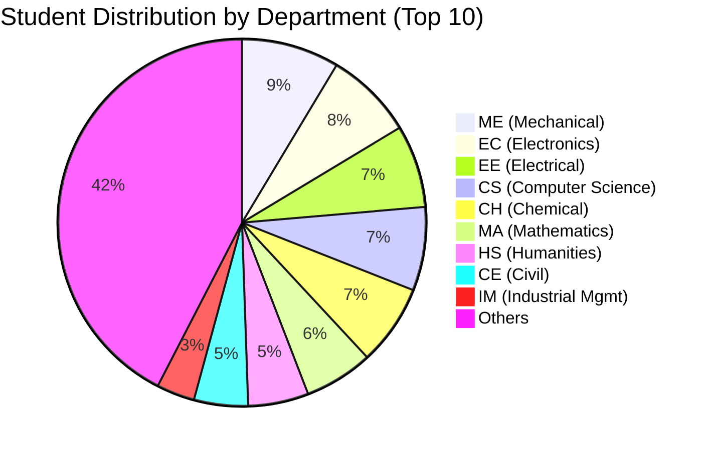

# SLIDE 3: Input Data Analysis - Student Dataset

## Slide Title
**"Student Demographics: Understanding the Talent Pool"**

---

## Main Visuals

### Visual 1: Department Distribution (Pie + Bar Chart)



### Visual 2: CGPA Distribution Histogram

```
        CGPA Distribution (All 1,223 Students)
        
Count   |           ███
 300    |       ███████████
        |     █████████████████
 200    |   ███████████████████████
        | ███████████████████████████
 100    | ███████████████████████████████
        |_________________________________
          6.0  6.5  7.0  7.5  8.0  8.5  9.0  9.5  10.0
                        CGPA →
                        
Mean CGPA: 7.85
Median: 7.80
Std Dev: 0.95
```

### Visual 3: Domain Preferences Matrix

| Domain | Primary Choice | Secondary Choice | Total Interest |
|--------|----------------|------------------|----------------|
| SDE (Software) | 862 (70%) | 225 (18%) | 1,087 (89%) |
| Data Science | 465 (38%) | 378 (31%) | 843 (69%) |
| Quant/Finance | 93 (8%) | 63 (5%) | 156 (13%) |
| Core Engineering | 263 (22%) | 445 (36%) | 708 (58%) |
| Consulting | 29 (2%) | 44 (4%) | 73 (6%) |

---

## Key Statistics

### 📊 Dataset Overview
- **Total Students**: 1,223
- **Departments**: 21 unique departments
- **CGPA Range**: 6.0 to 10.0
- **Average CGPA**: 7.85 ± 0.95

### 🎓 Department Breakdown
**Largest Departments:**
1. Mechanical Engineering (ME): 105 students (8.6%)
2. Electronics (EC): 95 students (7.8%)
3. Computer Science (CS): 90 students (7.4%)
4. Electrical (EE): 89 students (7.3%)
5. Chemical (CH): 87 students (7.1%)

**Smallest Departments:**
- Software Development (SD): 21 students
- Biotechnology (BT): 30 students
- Manufacturing (MF): 35 students

### 💡 CGPA Insights
**High Performers (CGPA ≥ 9.0):**
- 89 students (7.3%)
- Dominated by CS (20), MA (18), EC (15)

**Middle Band (7.0 - 9.0):**
- 892 students (72.9%)
- Majority of placement competition

**Lower Band (<7.0):**
- 242 students (19.8%)
- Often filtered by company CGPA cutoffs

### 🎯 Domain Preferences
**SDE Dominance:**
- 70% prefer SDE as primary domain
- Even non-CS departments show strong SDE interest
  - ME: 65% interested in SDE
  - EC: 78% interested in SDE
  - CH: 45% interested in SDE

**Emerging Patterns:**
- **Cross-domain aspirations**: 58% of students list 2 domains
- **Data Science surge**: 69% show interest (up from traditional years)
- **Core engineering decline**: Only 22% as primary choice

---

## Speaker Notes

### Opening (20 seconds)
"Let's dive into our input data, starting with the student dataset. We're working with 1,223 students across 21 departments - a diverse talent pool with varying academic backgrounds and career aspirations."

### Department Distribution (40 seconds)

**Present the Numbers:**
"The department distribution shows interesting patterns. Mechanical Engineering has the largest cohort with 105 students, followed by Electronics and Computer Science. This diversity is both a strength and a challenge - it means we need to model placements for students with vastly different skill sets."

**Highlight the Implication:**
"Notice that Computer Science, despite being smaller than ME and EC, has historically shown the highest placement rates. This creates an important modeling question: How do we fairly represent opportunities for all departments?"

### CGPA Distribution (50 seconds)

**Describe the Distribution:**
"The CGPA distribution follows a roughly normal pattern with a mean of 7.85. This is realistic - most students cluster in the 7.0-8.5 range, with fewer exceptional performers above 9.0 and fewer struggling students below 7.0."

**Explain the Modeling Impact:**
"This distribution is crucial for our model because:
- Companies typically set CGPA cutoffs between 6.5 and 7.5
- Students above 9.0 (89 students) have access to nearly all companies
- The dense middle band (7.0-9.0) creates intense competition
- Students below 7.0 face significant filtering"

**Statistical Note:**
"The standard deviation of 0.95 means there's healthy variance. Unlike some institutions where grade inflation creates a narrow range, our data shows genuine performance differences that companies can use for selection."

### Domain Preferences (50 seconds)

**Present the Trend:**
"This is perhaps the most revealing table. 70% of students list SDE (Software Development) as their primary domain preference. Even more striking - 89% show interest in SDE when you include secondary preferences."

**Explain the Shift:**
"This represents a fundamental shift in engineering education. Traditional core engineering roles have declined as primary choices. Even mechanical and chemical engineering students are learning to code and targeting software roles."

**Implications for Simulation:**
"For our model, this creates challenges:
- High competition for SDE roles (862 students competing for limited positions)
- Core engineering companies struggle to find interested candidates
- Students need cross-domain skills to remain competitive
- The model must account for students applying across multiple domains"

**Data Science Surge:**
"Notice the rise of Data Science - 69% interest. This wasn't a major category 5 years ago. Our model incorporates this trend by including numerous data analytics roles."

### Connect to Model (20 seconds)

"These patterns directly inform our simulation parameters:
- CGPA cutoffs filter the bottom 20%
- Department scores reflect historical success patterns
- Domain preferences drive application behavior
- Skill requirements separate qualified from unqualified candidates"

### Transition (10 seconds)
"Now let's look at the other side of the equation - the companies and their requirements."

---

## Visual Design Elements

### Layout
```
┌─────────────────────────────────────────────────────┐
│         STUDENT DEMOGRAPHICS & PREFERENCES          │
├─────────────────┬───────────────────────────────────┤
│                 │                                   │
│   Department    │        CGPA Distribution          │
│   Pie Chart     │         (Histogram)               │
│                 │                                   │
├─────────────────┴───────────────────────────────────┤
│                                                     │
│       Domain Preferences Heat Map / Table           │
│                                                     │
└─────────────────────────────────────────────────────┘
```

### Color Coding
**Department Categories:**
- 🔵 Blue: CS, MA, EC (High-demand technical)
- 🟢 Green: ME, EE, CH (Core engineering)
- 🟡 Yellow: HS, IM, SD (Cross-functional)
- 🟠 Orange: Specialized (GG, MT, BT, etc.)

**CGPA Ranges:**
- 🔴 Red: <7.0 (At-risk)
- 🟡 Yellow: 7.0-8.5 (Competitive)
- 🟢 Green: 8.5-9.5 (Strong)
- 🟣 Purple: >9.5 (Elite)

### Interactive Elements (if using digital presentation)
- **Hover over department** → shows median CGPA
- **Click on CGPA range** → highlights students in that range
- **Select domain** → shows department breakdown

---

## Data Tables (Handout / Backup)

### Top 10 Departments by Size
| Rank | Department | Students | % of Total | Median CGPA |
|------|------------|----------|------------|-------------|
| 1 | Mechanical (ME) | 105 | 8.6% | 7.65 |
| 2 | Electronics (EC) | 95 | 7.8% | 8.02 |
| 3 | Computer Science (CS) | 90 | 7.4% | 8.45 |
| 4 | Electrical (EE) | 89 | 7.3% | 7.88 |
| 5 | Chemical (CH) | 87 | 7.1% | 7.52 |
| 6 | Mathematics (MA) | 74 | 6.0% | 8.38 |
| 7 | Humanities (HS) | 65 | 5.3% | 7.95 |
| 8 | Civil (CE) | 58 | 4.7% | 7.42 |
| 9 | Geology (GG) | 47 | 3.8% | 7.35 |
| 10 | Industrial Mgmt (IM) | 41 | 3.4% | 7.89 |

### CGPA Quartiles by Department
| Department | Q1 (25%) | Median (50%) | Q3 (75%) | Top (90%) |
|------------|----------|--------------|----------|-----------|
| CS | 8.1 | 8.45 | 8.9 | 9.3 |
| MA | 7.9 | 8.38 | 8.8 | 9.2 |
| EC | 7.5 | 8.02 | 8.6 | 9.1 |
| ME | 7.2 | 7.65 | 8.1 | 8.7 |
| CH | 7.0 | 7.52 | 8.0 | 8.5 |

---

## Backup Questions & Answers

**Q: "How did you collect this data?"**
A: "The data is based on actual student records from IIT Kharagpur's 2023-24 batch. We have anonymized roll numbers, departments, CGPAs from semester records, and domain preferences from pre-placement surveys."

**Q: "Why is SDE so dominant?"**
A: "Multiple factors: higher compensation in tech industry, location flexibility (many companies in Bangalore/Hyderabad), skill transferability, and industry growth. Traditional core engineering has slower growth and often requires specific locations."

**Q: "Does CGPA really matter that much?"**
A: "Our analysis shows it matters most at extremes. Students above 9.0 have ~95% placement rates. Students below 7.0 have ~30% rates. In the middle (7.0-9.0), skills and interview performance become differentiators."

**Q: "Any gender or other demographic analysis?"**
A: "The current model focuses on department, CGPA, and skills. Gender and other demographics are not factors in company selection processes, per placement cell policies, so we didn't include them in scoring."

---

## Timing
- **Slide introduction**: 0:00-0:20
- **Department distribution**: 0:20-1:00
- **CGPA analysis**: 1:00-1:50
- **Domain preferences**: 1:50-2:40
- **Model connection**: 2:40-3:00
- **Transition**: 3:00-3:10

**Total: ~3 minutes**
