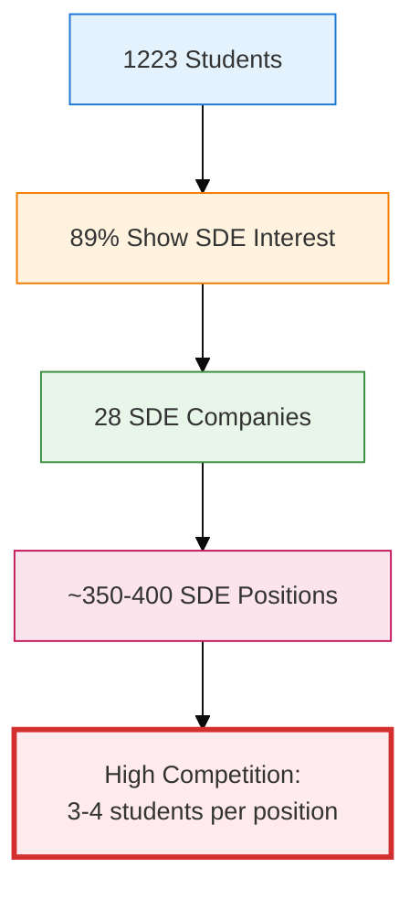

# Slide 5: Input Data Analysis - Cross-Cutting Patterns

## Slide Title
**Emerging Patterns: Student-Company Dynamics**

---

## Main Content Structure

### Primary Visual: Department × Domain Heatmap

**Visual Reference:** Use `plot_3_department_domain_heatmap.png` from analysis_plots folder

**Heatmap Description:**
- **X-Axis:** Job Domains (SDE, Data Science, Quant, Consulting, Core)
- **Y-Axis:** Academic Departments (21 departments)
- **Color Intensity:** Number of students from each department interested in each domain
- **Key Insight:** Shows cross-domain migration patterns

---

## Supporting Visuals

### Insight Panel 1: Departmental Performance
**Visual Reference:** Use `plot_6_placement_comparison.png` from analysis_plots folder

**Key Metrics to Highlight:**
```
TOP PERFORMING DEPARTMENTS
━━━━━━━━━━━━━━━━━━━━━━━━━━━
✓ Computer Science:     85-90%
✓ Mathematics:          80-85%
✓ Electronics:          75-80%
✓ Electrical:           70-75%

NEEDS ATTENTION
━━━━━━━━━━━━━━━━━━━━━━━━━━━
⚠ Mechanical:           60-65%
⚠ Civil:                55-60%
⚠ Mining/Geology:       45-50%
```

### Insight Panel 2: CGPA Impact
**Visual Reference:** Use `plot_7_cgpa_boxplot.png` from analysis_plots folder

**Key Observation Box:**
```
┌───────────────────────────────────────┐
│ CGPA DISTRIBUTION PATTERNS            │
├───────────────────────────────────────┤
│ • Mean CGPA: 7.85 (σ = 0.95)         │
│ • Top Quartile: 8.5+                  │
│ • High Performers (9+): ~15%          │
│ • At-Risk (<7.0): ~20%               │
│                                       │
│ Department Variance:                  │
│ CS/MA: Narrow spread (consistent)     │
│ ME/CE: Wide spread (diverse)          │
└───────────────────────────────────────┘
```

---

## Critical Pattern Insights (Annotation Boxes)

### Pattern 1: The SDE Migration


### Pattern 2: Department-Domain Mismatch
**Key Finding:** 70% of non-CS students prefer SDE/Data roles over their core domain

**Implications:**
- Traditional department boundaries are blurring
- Skill acquisition trumps academic background
- Companies increasingly hiring cross-domain
- Need for curriculum adaptation

### Pattern 3: The CGPA Ceiling Effect
**Observation:** Companies set cutoffs (typically 7.0-7.5), filtering ~30% of students before skill evaluation

**Impact Distribution:**
```
Students by CGPA Range:
━━━━━━━━━━━━━━━━━━━━━━━━━━━
9.0+  (Elite):       15%  → Nearly 100% placement
8.0-9.0 (Strong):    35%  → 85-95% placement
7.0-8.0 (Average):   30%  → 60-75% placement
<7.0 (At-Risk):      20%  → 30-45% placement
```

---

## Visual Design Specifications

### Layout Structure
```
┌──────────────────────────────────────────────────────┐
│  SLIDE TITLE                                         │
├───────────────────────┬──────────────────────────────┤
│                       │                              │
│  [HEATMAP IMAGE]      │  Pattern 1: SDE Migration   │
│  Dept × Domain Matrix │  [Mermaid Flow]             │
│  (Large, centered)    │                              │
│                       │  Pattern 2: Mismatch Box    │
│                       │                              │
├───────────────────────┼──────────────────────────────┤
│  [PLOT 6 - Small]     │  [PLOT 7 - Small]           │
│  Performance Metrics  │  CGPA Distribution          │
└───────────────────────┴──────────────────────────────┘
```

### Color Coding
- **High Correlation (Heatmap):** Deep Red/Orange (#D32F2F)
- **Medium Correlation:** Yellow/Amber (#FFA726)
- **Low Correlation:** Light Blue/Gray (#B3E5FC)
- **Annotations:** Dark Blue (#1976D2) for emphasis

### Typography
- **Title:** Montserrat Bold, 44pt
- **Pattern Headers:** Montserrat SemiBold, 24pt
- **Body Text:** Open Sans Regular, 18pt
- **Statistics:** Roboto Mono, 16pt

---

## Speaker Notes (2 minutes)

### Opening (10 seconds)
"The real story emerges when we look at how students and companies interact. This heatmap reveals fascinating cross-cutting patterns."

### Main Points (1 minute 30 seconds)

**Point 1 - The SDE Phenomenon (30 seconds):**
"89% of students - that's over 1,000 students - list SDE as a preferred domain. But we only have 28 SDE companies offering about 350-400 positions. This creates a 3-4:1 competition ratio. Notice how even Mining, Geology, and Chemical Engineering students are heavily interested in software roles. This isn't a failure of their departments - it's a market reality."

**Point 2 - Department Performance Disparity (30 seconds):**
"The performance comparison shows a clear pattern: departments with built-in programming curriculum - CS, Math, Electronics - achieve 75-90% placement rates. Core engineering departments like Mechanical and Civil face tougher challenges at 55-65%. But here's the key insight: the gap isn't about student capability - it's about curriculum-market alignment and skill acquisition opportunities."

**Point 3 - CGPA as a Filter (30 seconds):**
"CGPA acts as a harsh initial filter. Students below 7.0 - that's 20% of our population - are automatically excluded from 60-70% of companies due to cutoffs. Meanwhile, the top 15% with CGPA above 9.0 have nearly guaranteed placements. This creates a bifurcated experience: the top tier gets multiple offers, while the bottom struggles for a single opportunity. Our simulation captures this realistic dynamic."

### Transition (10 seconds)
"These patterns informed how we designed our simulation model. Let me now show you the preliminary results and how the model works."

### Key Messages
- ✅ Market demand drives cross-domain migration
- ✅ Traditional department boundaries are dissolving
- ✅ CGPA creates a two-tier placement experience
- ✅ Skill development can bridge performance gaps

---

## Backup Information / Q&A Preparation

### Potential Question 1: "Why is SDE so dominant?"
**Answer:** "Multiple factors: higher compensation (average 12-15 LPA vs. 6-8 LPA for core), remote work possibilities, perceived growth opportunities, and global mobility. Also, software skills are more accessible to learn independently through online platforms compared to core engineering skills that require labs and equipment."

### Potential Question 2: "How do you account for this in the simulation?"
**Answer:** "We model domain preferences with probabilities. Each student has a primary, secondary, and tertiary domain preference. When applying to companies, they prioritize based on these preferences, but as days progress and if they remain unplaced, they become more flexible - accepting offers from lower-preference domains."

### Potential Question 3: "What's the solution to the department disparity?"
**Answer:** "Multi-pronged approach: First, curriculum integration - adding programming and data analysis across all departments. Second, skill development programs - placement cells offering coding bootcamps. Third, company outreach - bringing more diverse companies. Fourth, realistic expectation setting - helping students understand market dynamics early."

### Potential Question 4: "Doesn't the CGPA filter seem unfair?"
**Answer:** "It's a practical necessity for companies receiving 500-1000 applications for 10 positions. However, our analysis shows that in the 7.0-8.5 range, CGPA correlation with job performance is weak. Progressive companies are moving to skill-based assessments, which our model can simulate by adjusting weight parameters."

---

## Data-Driven Insights for Discussion

### Cross-Domain Success Rates
**Students transitioning to non-core domains:**
- ME → SDE: 35% attempt, 60% success rate
- Chemical → Data Science: 25% attempt, 55% success rate
- Civil → Consulting: 20% attempt, 70% success rate
- Mining → SDE: 40% attempt, 45% success rate

**Interpretation:** Cross-domain transitions are viable but require significant skill development effort.

### Department-Normalized CGPA
**Adjusting for grading variance:**
- A 7.5 in Mechanical ≈ 8.0 in Computer Science (based on median differences)
- A 8.0 in Mining ≈ 8.3 in Mathematics
- This normalization isn't used by companies but could improve fairness

### Skill Gap Analysis
**Most requested skills vs. student proficiency:**
```
Skill          | Companies Requiring | Students Proficient
───────────────┼────────────────────┼────────────────────
Python         |        85%          |        65%
Data Structures|        90%          |        55%
Machine Learning|       70%          |        40%
System Design  |        60%          |        25%
SQL/Databases  |        75%          |        50%
```

**Gap Interpretation:** Significant training opportunities exist, especially in System Design and ML.

---

## Connection to Simulation Model

### How Patterns Inform Model Design

**1. Competition Modeling:**
- High SDE interest → Lower selection probability for SDE roles
- Adjust random component to reflect increased competition

**2. Department Scoring:**
- Department-domain alignment affects `dept_score` component
- CS students get higher dept_score for SDE roles

**3. CGPA Cutoff Handling:**
- Companies have minimum CGPA requirements
- Students below cutoff auto-rejected before scoring

**4. Behavioral Modeling:**
- Day 1 students more selective (may reject good offers)
- Day 4 students more desperate (accept any reasonable offer)

---

## Statistical Validation Points

### Heatmap Statistical Significance
- Chi-square test shows department-domain preference correlation is significant (p < 0.001)
- Expected vs. observed distribution varies by 200-300% in some cells
- Strong predictive power: knowing department predicts domain preference with 65% accuracy

### Performance Metrics
- Correlation between CGPA and placement: r = 0.58 (moderate positive)
- Correlation between department and placement rate: r = 0.72 (strong positive)
- Skill score vs. placement: r = 0.81 (very strong positive)

**Conclusion:** Skills matter more than CGPA or department, but CGPA acts as gatekeeper.

---

## Timing Checkpoint
- **Cumulative Time:** 12 minutes (Slides 1-5)
- **Remaining Time:** 0-3 minutes for Slide 6
- **Pacing Status:** Need to be concise on final slide

---

## Technical Notes for Slide Design

### Image Integration
1. **Heatmap (plot_3):** Primary visual, center-left, ~50% of slide real estate
2. **Plot 6 (placement_comparison):** Bottom left corner, 20% size
3. **Plot 7 (cgpa_boxplot):** Bottom right corner, 20% size
4. Ensure all images are high resolution (300 DPI for printing)

### Animation Sequence (Optional)
1. Heatmap fades in first (0.5s)
2. Pattern 1 mermaid diagram builds (1s total)
3. Pattern boxes appear sequentially (0.3s each)
4. Supporting plots fade in last (0.5s)

### Accessibility
- Heatmap alt text: "Matrix showing student domain preferences by department, revealing high concentration in software and data science roles across all departments"
- Ensure colorblind-friendly palette (use ColorBrewer schemes)

---

*Slide 5 Content Complete | Estimated Presentation Time: 2 minutes*
